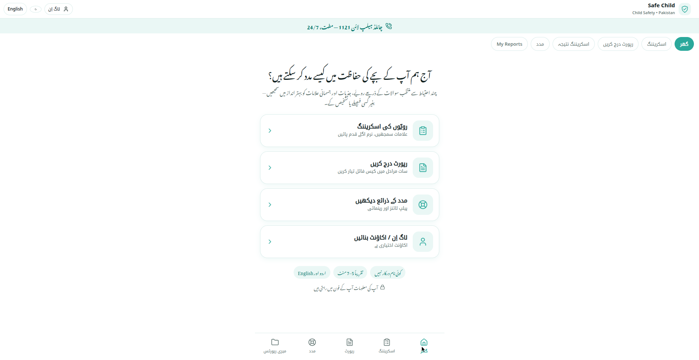
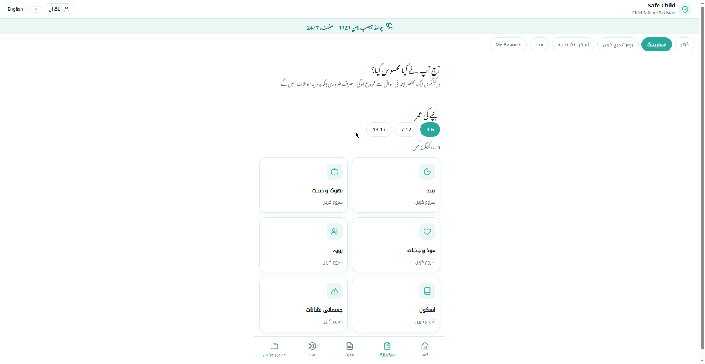
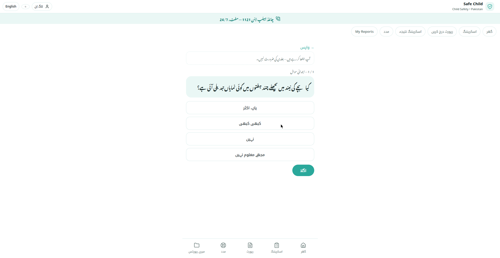
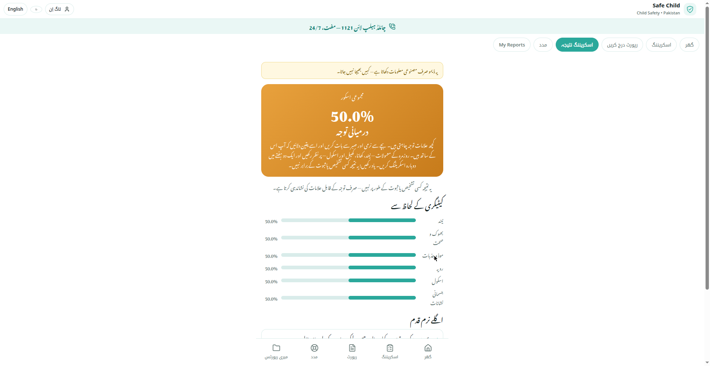
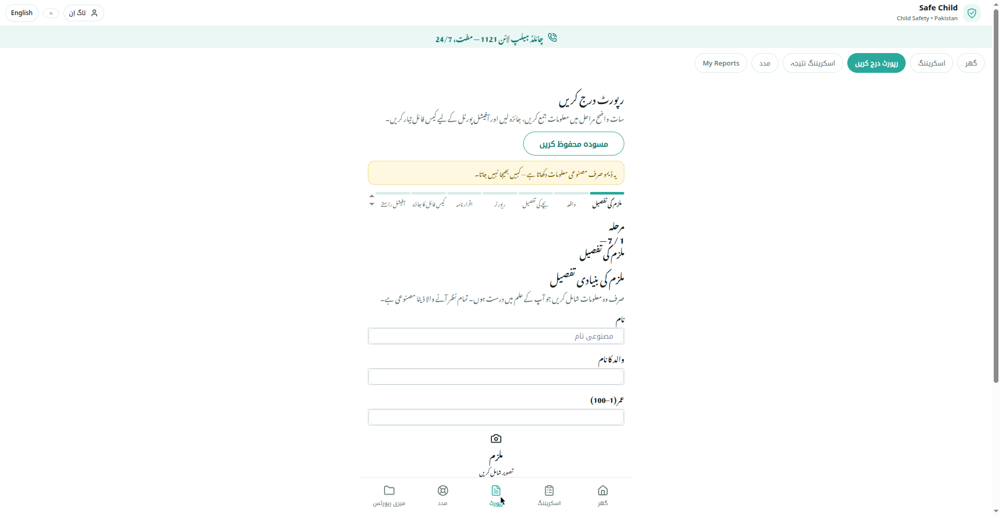

# 🛡️ Safe Child — Child Safety Pakistan

<div align="center">


**[🔴 Live App](https://muhammadnaveedgurmanii-png--safe-child.modal.run)**

*Every child deserves to feel safe.*

</div>

One app, two modules:

1. **Adaptive behavioral screening** — rule-based expert system (NOT ML).
   Six signal categories (Neend, Bhook/Sehat, Mood/Jazbaat, Behavior, School,
   Jismani Nishanat), age-specific question banks (3–6, 7–12, 13–17), weighted
   scoring into low / moderate / high / critical bands. Critical triggers
   (e.g. unexplained marks, direct disclosure, intense fear of a person)
   bypass scoring and route straight to the 1121 action plan.
   Results describe indicators and next steps — never a diagnosis.
2. **Formal abuse-report filing** — 7-step wizard (accused, incident, child,
   reporter, truthfulness declaration, case-file review, official channels)
   producing a unique Case ID, timestamped case file and printable/downloadable
   record, plus FIA / Punjab Police portal links and 1121 click-to-call.

100% Python via [Reflex](https://reflex.dev) — no handwritten JavaScript.
Urdu (RTL, Noto Nastaliq Urdu) + English, dark mode, mobile-first.

## 📸 Screenshots

| Home | Screening Categories |
|---|---|
|  |  |

| Screening Question | Results & Action Plan |
|---|---|
|  |  |

| Case-File Wizard |
|---|
|  |

## Stack (100% free)

- **Reflex** — full-stack Python app
- **Supabase** (free tier) — PostgreSQL for accounts, screenings, reports
- **Custom Python auth** — PBKDF2 password hashing + JWT sessions
- **Render** (free tier) — single web service

## Local setup

```bash
python -m venv .venv && source .venv/bin/activate
pip install -r requirements.txt
cp .env.example .env   # fill in SUPABASE_URL, SUPABASE_KEY, JWT_SECRET
```

Create a free project at [supabase.com](https://supabase.com), then run
`supabase/schema.sql` in its SQL editor (creates `users`, `screenings`,
`reports` tables).

```bash
reflex run
```

Open http://localhost:3000. Without Supabase credentials the app runs in
**offline demo mode**: screening works fully, accounts and report history
fall back to a session-only demo.

## Deploy (Render)

1. Push this repo to GitHub.
2. In Render: **New → Blueprint** and point it at the repo (`render.yaml`).
3. Set env vars `SUPABASE_URL`, `SUPABASE_KEY` (JWT_SECRET is auto-generated).
4. Deploy. Free-tier services sleep when idle — first load takes ~30s.

## Privacy & safety notes

- Screening works without an account. Photos stay on-device unless the user
  explicitly attaches them to a report.
- Demo/synthetic data only until a real report is filed by the user.
- The app never claims direct submission to FIA/police — it produces a
  case file and deep-links the official portals; the user files it themselves.
- CNIC + relatives-only reporter options + truthfulness declaration deter
  false reports but do not verify identity.
- Screening content should be reviewed by a qualified child psychologist
  before any production rollout involving real families.
